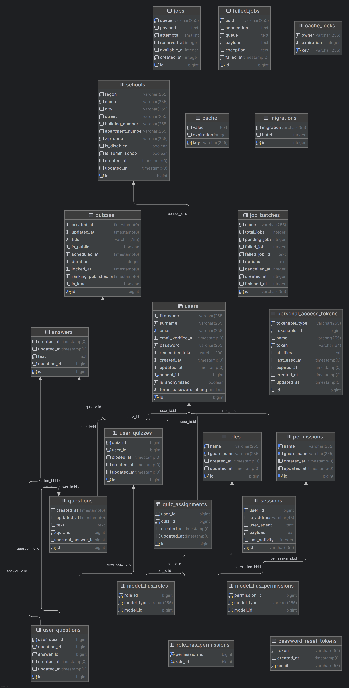

# Opis

## Baza danych

## Role 
Jak działają i jakie są role
### Super Admin
Istnieje super administrator ze wszystkimi uprawnieniami. Zawiera uprawnienia zwykłego administratora oraz umożliwia tworzenie i usuwanie kont administratorów i anonimizowanie użytkowników. Istnieje tylko jedno takie konto.

### Admin
Administrator może tworzyć oraz zmieniać dane użytkowników, tworzyć quizy i nimi zarządzać, dodawać i importować szkoły z API RSPO - https://rspo.gov.pl .

### User
Zalogowany, potwierdzony użytkownik może brać udział w konkursach, zmieniać hasło na swoim profilu użytkownika. Ma wgląd do rankingu quizu, w którym brał udział, jeżeli ten został opublikowany. 

### Guest
Nie zalogowany użytkownik, może zalogować się jeżeli posiada konto, zarejestrować sie, przypomnieć hasło do istniejącego konta poprzez e-mail.

## Quizy
Przechowuje informacje o danym teście, pytania (`Question.php`) oraz dostępne odpowiedzi (`Answer.php`).

### `duration`
`duration` ustawia czas trwania quizu w formacie `YYYY-MM-DD:SS`
# `scheduled_at`
`Quiz` przyjmuje 3 stany
- draft (`scheduled_at` ustawione na null), w tym stanie quiz może być edytowany.
- scheduled (`scheduled_at` ustawione na datę późniejszą niż obecna (na przykład na jutro)), w tym stanie quiz nie może być edytowany. Aby edytować quiz ustaw scheduled_at na null.
- published (`scheduled_at` ustawione na datę która już mineła), w tym stanie quiz jest dostępny dla użytkowników, mogą oni zacząć go uzupełniać. Quiz w tym stanie jest tylko do odczytu, administrator może go skopiować oraz przeglądać, quiz nie może zostać usunięty, oraz nie powinien być zmieniany.

### `is_local`
`Quiz` może odbywać się lokalnie na uczelni lub online. 

### `is_public`
Quiz może być dostępny dla wszystkich uczniów (będzie widoczny z poziomu dashboard ucznia), lub tylko dla zaproszonych. Zaproszeni użytkownicy są przechowywani w tabeli quiz_assignments (model `QuizAssignment`)

## UserQuiz
`UserQuiz` jest odpowiedzialny za przechowywanie odpowiedzi użytkowników (`UserQuestion`). Jest tworzony na podstawie quizów w stanie published (Gdy user weźmie udział w quiz'ie, patrz `CreateUserQuizAction.php`).

### Zamknięcie quizu
- Gdy czas testu dobiegnie końca możliwość udzielania odpowiedzi jest blokowana (patrz `UserQuestionPolicy.php`).
- Gdy `Quiz` zostaje opublikowany, zostaje uruchomiony job `CloseUserQuizJob`, który wysyła event `AssignedQuizClosed` gdy user zapisał się do testu, ale nie wziął w nim udziału. Gdy user wziął udział w teście wysyłany jest event`UserQuizClosed`. Na te eventy nasłuchują listener'y `SendAssignedQuizClosedNotification`, `SendQuizClosedNotification` które wysyłają odpowiednie e-maile.

## Ranking
Nie posiada własnego modelu, tworzony jest deklaratywnie na podstawie informacji zawartych w `UserQuiz` i `UserQuestion`. Ranking domyślnie nie jest widoczny dla użytkowników, aby go opublikować pole `Quiz::ranking_published_at` musi być inne niż `null`.
Administrator może go opublikować ale również wycofać, może to zrobić w momencie w którym konkurs zostanie zakończony.

## Zapraszanie
Użytkownik (jeden lub wielu na raz) może zostać zaproszony do quizu przez administratora.
Po wysłaniu zaproszenia, e-mail zostaje wysłany z opóźnieniem 15 minut.
Jeśli w tym czasie operacja zostanie cofnięta, e-mail nie zostanie wysłany.
